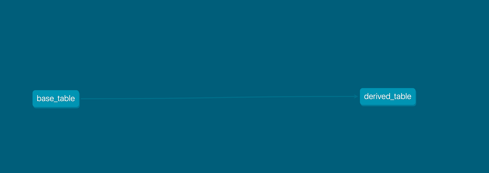
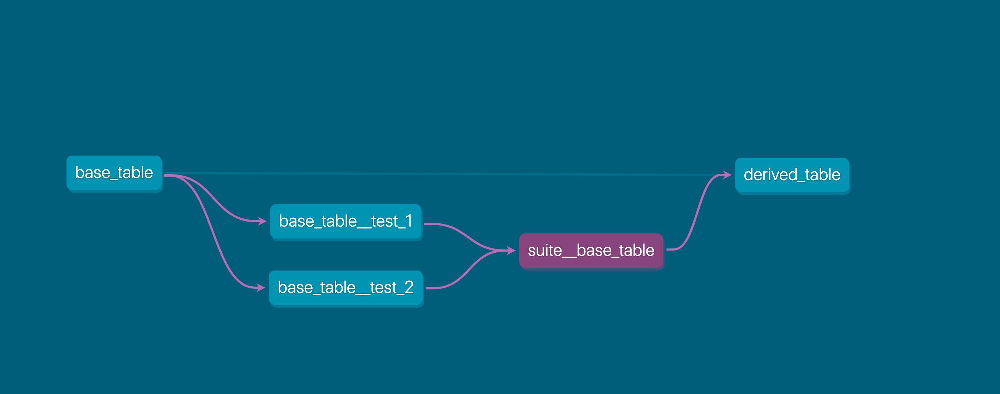

# dbt-circuit-breaker

**dbt-circuit-breaker** is a plugin for [**dbt**](https://github.com/fishtown-analytics/dbt) interrupts data transformations after a fault is detected. By injecting the functionality of `dbt test` into `dbt run`, it allows for a subset of tests for a model to be executed _before_ downstream models are built.

This project name is inspired by the description of a circuit breaker on Wikipedia:
> A circuit breaker is an automatically operated electrical switch designed to protect an electrical circuit from damage caused by excess current from an overload or short circuit. Its basic function is to interrupt current flow after a fault is detected.

## Install

Include in `packages.yml`

```yaml
packages:
  - package: dbeatty10/dbt-circuit-breaker
    version: [">=0.1.0", "<0.2.0"]
```

Install the package:

```shell
dbt deps
```

## Usage

`dbt run` will execute any tests and test suites that have been injected as stand-alone models in the DAG.

See below for example source code for injecting dbt tests whenever you execute:
```shell
dbt run --models +derived_table
```

## Example

Before:


After:


This package does **not** provide a single command that will convert schema tests in `_models.yml` to stand-alone models with the test materialization. It merely provides 2 new materializations and 1 macro that allow such models to be created by hand:
- `test` materialization for a single test
- `noop` materialization to represent a suite a tests
- `tested` macro to depend on the _test suite_ of a model rather than depending directly on the model

### Source tree
```
.
└── your_dbt_project/
    └── models/
        ├── mart/
        │   ├── base_table.sql
        │   └── derived_table.sql
        ├── test_suites/
        │   └── suite__base_table.sql
        └── tests/
            ├── base_table__test_1.sql
            └── base_table__test_2.sql
```

### Code

The following example assumes that the [**dbt-utils**](https://github.com/fishtown-analytics/dbt-utils) package is installed along with the dbt-circuit-breaker package.

The base model to be tested.
```sql
-- models/mart/base_table.sql

{{ config(materialized='table')}}

select * from {{ source('raw', 'your_raw_table') }}
```

You want the derived table to depend on a suite of tests named `suite__base_table` rather than directly on `base_table`, but you still want to query from the base model.
```sql
-- models/mart/derived_table.sql

{{ config(materialized='table')}}

select * from {{ dbt_circuit_breaker.tested('base_table', 'suite__base_table') }}
```

Configure two trivial tests.
```sql
-- models/tests/base_table__test_1.sql

{{ config (materialized="test") }}

{{ dbt_utils.test_expression_is_true(ref('base_table'), expression="1=1") }}
```

```sql
-- models/tests/base_table__test_2.sql

{{ config (materialized="test") }}

{{ dbt_utils.test_expression_is_true(ref('base_table'), expression="2=2") }}
```

**Note:** Change the expression to `1=0` in either of the tests above to trip the circuit breaker.

Configure a suite a tests.
```sql
-- models/test_suites/suite__base_table.sql

{{ config(materialized='noop')}}

-- All the test materializations for a single model:
-- {{ ref('base_table__test_1') }}
-- {{ ref('base_table__test_2') }}
```

### Run

Run the `derived_table` and all ancestors:
```shell
dbt run --models +derived_table
```

A circuit breaker will trip prior to the `derived_table` model if it depends on any test models that fail.

Run the test suite for the base table and all its ancestors:
```shell
dbt run --models +suite__base_table
```

### Explanation
Note how instances of the `ref()` macro are replaced with `tested()` in the downstream derived model.

`tested(upstream_model, test_suite)` is functionally equivalent to [forcing dependencies](https://docs.getdbt.com/reference/dbt-jinja-functions/ref#forcing-dependencies) like the following:
```sql
-- models/downstream_model.sql

-- depends on: {{ ref('test_suite') }}
select * from {{ ref('upstream_model') }}
```

## Quality of life

To lessen the typing burden, you can define the following macro within your _local_ project:

```sql
-- macros/etc/tested.sql



  


```

This allows rewriting this:
```sql
select * from {{ dbt_circuit_breaker.tested('base_table', 'suite__base_table') }}
```
more succinctly as:
```sql
select * from {{ tested('base_table', 'suite__base_table') }}
```
